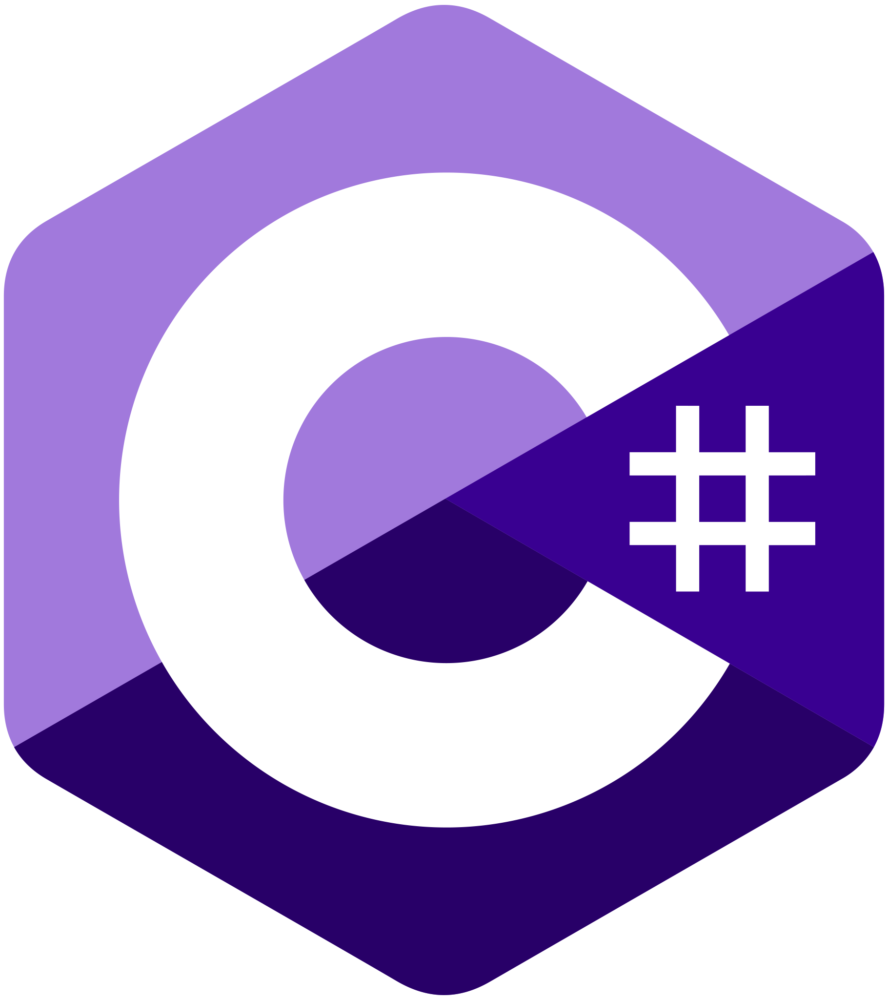

### Hi there 👋

My name is Calvin Cai, I'm an open-source software developer, [blogger](https://www.caiyunlin.com).  

<b>I offen use:</b>

|   |  |  |  |  |  |  |
| :---------------: | :---------------: | :---------------: | :---------------: | :---------------: | :---------------: | :---------------: |
| Docker  | C# | Node.js | JavaScript | BASH | Python | PHP |

welcome to make friends [with me](mailto:cylin2000@163.com)